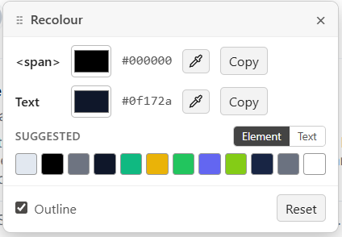

# Recolour

A Chrome extension that lets you right-click any element on a webpage and recolor it on the fly — background, border, shadow, or text — without touching DevTools.

## Features

- **Right-click → Recolour** to open a draggable popup with controls for whichever color properties the element actually has (background, border, shadow, text).
- **Native color picker** on each row for fine-tuning, plus an **eyedropper** to sample any pixel on the page.
- **Suggested palette** of the most-used colors on the current page, applied with one click.
- **Yellow highlight outline** marks the element you're editing (toggleable).
- **Reset** restores the element's original styles.
- **Hex everywhere** — copy or apply colors as `#RRGGBB` (or `#RRGGBBAA` if the source has alpha).

## Install (load unpacked)

1. Clone or download this repo to a folder on your machine.
2. Open Chrome and navigate to `chrome://extensions`.
3. Toggle **Developer mode** on (top-right corner).
4. Click **Load unpacked** and select the cloned folder.
5. The paintbrush icon should appear in your extensions list.

To use it, right-click any element on a webpage and choose **Recolour** from the context menu. If the page was open before you installed the extension, the first right-click will auto-inject the content script and prompt you to right-click again — after that it works on every page.

## Files

- `manifest.json` — Manifest V3 config
- `background.js` — service worker that registers the context menu
- `content.js` — page-side UI and color logic
- `icon.svg` / `icons/` — extension icon (SVG source + rasterized PNGs)
